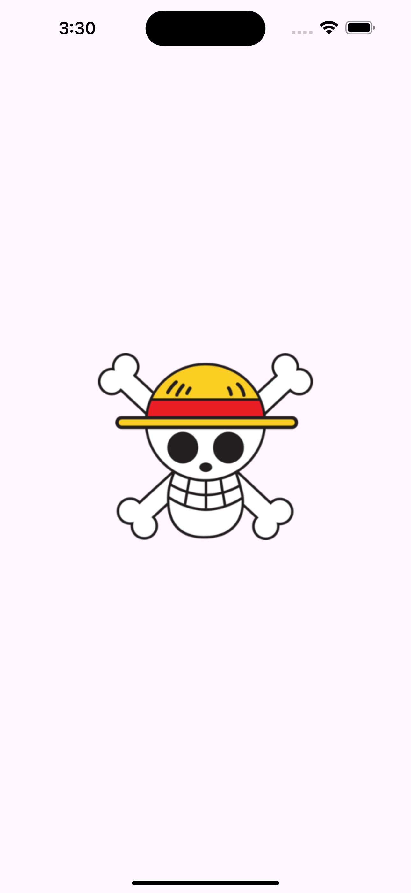

# Praktikum 1
1. praktikum text widget
2. praktikum image widget
3. praktikum kombinasi images dan text

# Tahapan kombinasi images dan text

1. buat class Praktikum
2. inisialisasi widget pada class praktikum
3. panggil images dan masukkan ukuran 200x200
4. masukkan text welcome

# Screenshot

